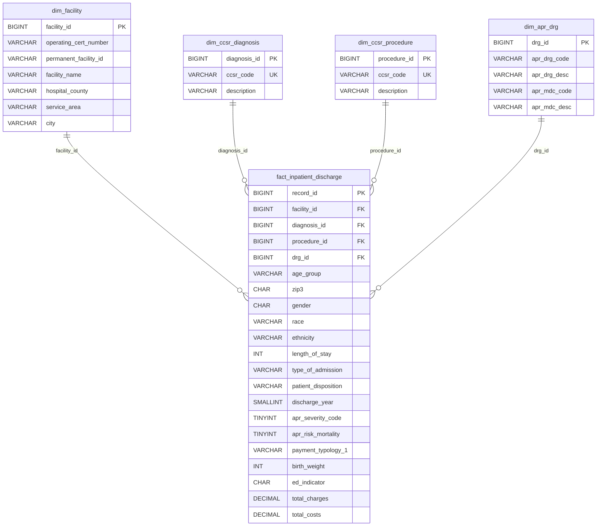

# 数据库 ER 图与设计说明

## 一、设计思路

采用**星型模式（Star Schema）**：1 张核心**事实表** + 4 张**维度表**，既满足 200 万+ 条记录的存储与查询性能，又符合"设计合理表结构、优化索引"的项目要求。

```
                    ┌─────────────────────────┐
                    │   dim_ccsr_diagnosis    │
                    │  (CCSR 诊断字典)         │
                    └───────────┬─────────────┘
                                │ diagnosis_id
                    ┌─────────────────────────┐
                    │   dim_ccsr_procedure    │
                    │  (CCSR 操作字典)         │
                    └───────────┬─────────────┘
                                │ procedure_id
 ┌──────────────────┐          │
 │   dim_facility   │          │           ┌────────────────────┐
 │   (医疗机构维度)  │ facility_id         │    dim_apr_drg      │
 └────────┬─────────┘──────────┼───────────│  (APR DRG 维度)     │
          │                    │           └──────────┬─────────┘
          │                    │ drg_id               │
          ▼                    ▼                      ▼
     ┌──────────────────────────────────────────────────────┐
     │           fact_inpatient_discharge（住院出院事实表）    │
     │  facility_id / diagnosis_id / procedure_id / drg_id   │
     │  + 患者人口统计学属性 + 住院信息 + 费用 + 支付方式等      │
     └──────────────────────────────────────────────────────┘
```

## 二、ER 图（Mermaid）



## 三、设计要点

| 要点 | 说明 |
| --- | --- |
| **代理键** | 每张维度表用自增 `*_id` 作为主键，事实表通过外键关联，避免直接使用业务编码（如运营证书号）做主键带来的存储与更新成本 |
| **患者无唯一ID** | 原始数据无患者唯一标识，人口统计学字段（年龄组/性别/种族/民族/邮编）作为事实表属性存储，不做独立的患者维度表 |
| **字典表复用** | CCSR 诊断/操作、APR DRG 等描述性字段抽离为维度表，减少事实表冗余（200万条 × 描述文本会很占空间） |
| **索引优化** | 针对聚合分析高频字段（年份、年龄组、诊断、支付方式、严重程度）建立索引；诊断×年份建复合索引加速交叉聚合 |
| **金额字段** | `total_charges` / `total_costs` 用 `DECIMAL(14,2)` 避免浮点精度损失 |
| **出生体重可空** | 非新生儿的 `birth_weight` 按业务规则置 `NULL`（对应需求中的 N/A 处理） |

## 四、性能说明

- 200 万+ 记录批量入库时，建议**分批提交**（每批 5000–10000 条）+ 关闭 `autocommit`，可显著提升写入速度。
- 分析查询通过维度表外键 + 事实表索引命中，避免全表扫描。
- 若引入 Hadoop/HDFS 作为历史数据冷备，MySQL 只保留"热"数据用于实时分析 API 查询。
